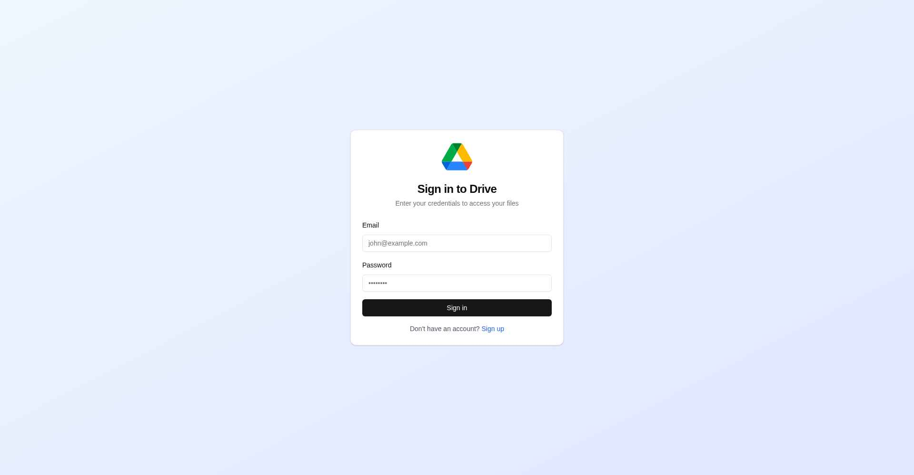
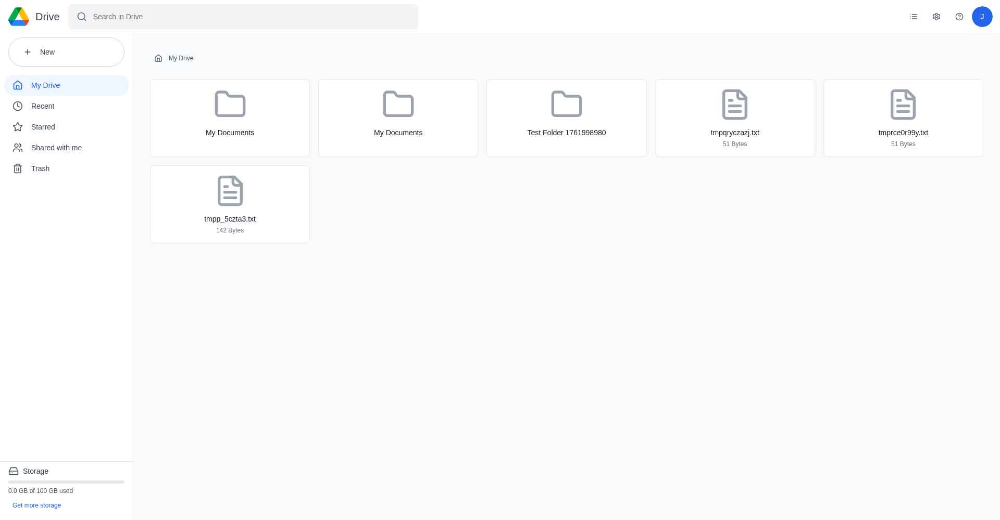
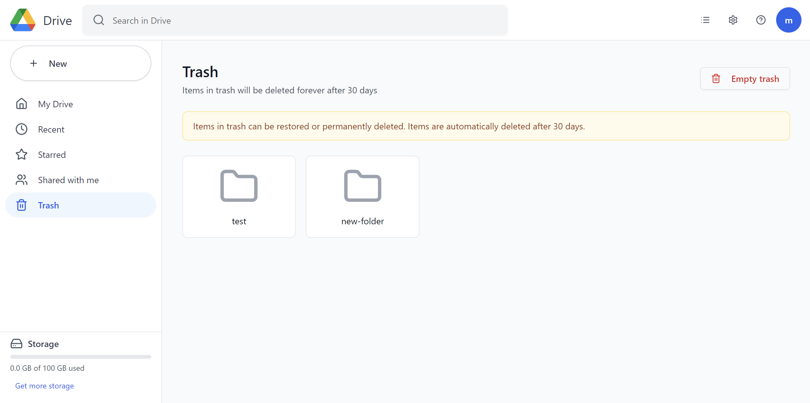
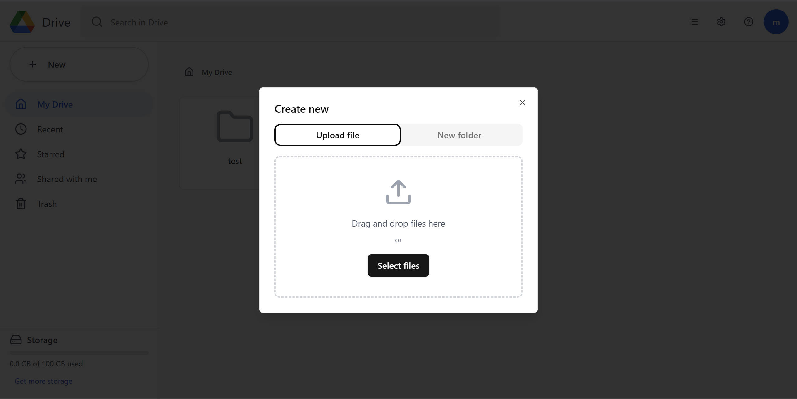
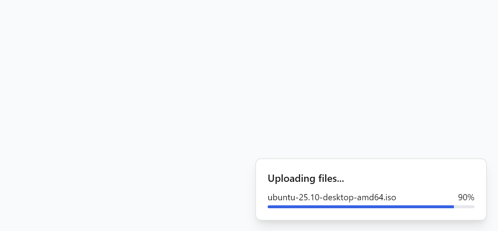
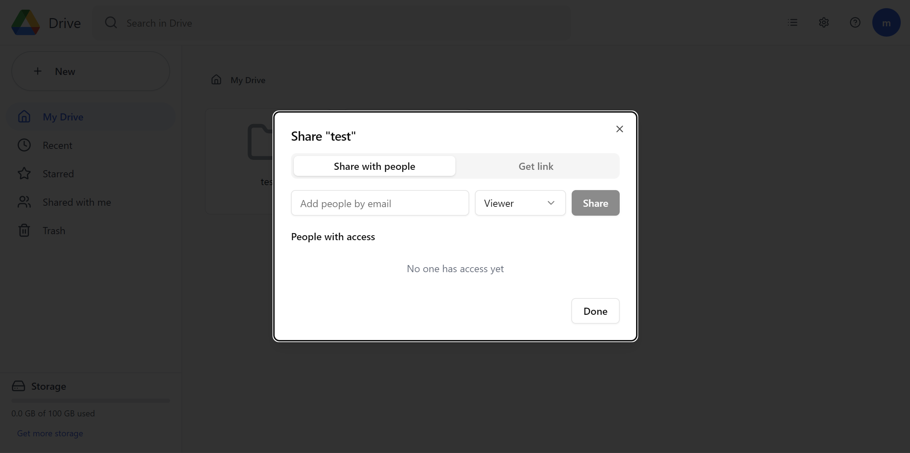
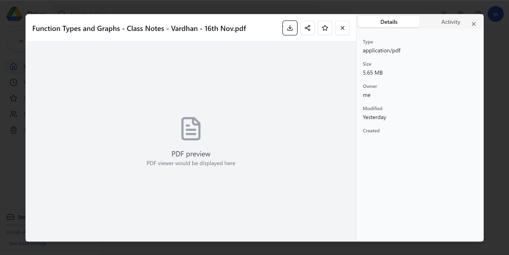

# Google Drive Clone - AI Agent Training Environment

A fully functional Google Drive clone built as a reinforcement learning environment for AI agents. This application replicates core Google Drive features including file management, folder hierarchy, sharing, comments, and storage analytics.


## Features

### Complete Feature Set
- **User Authentication**: Secure JWT-based authentication with bcrypt password hashing
- **File Management**: Upload, download, rename, delete, move files with metadata tracking
- **Folder Hierarchy**: Create nested folders with breadcrumb navigation
- **Multiple Views**: My Drive, Recent, Starred, Shared with me, Trash
- **File Sharing**: Share files/folders with granular permissions (Viewer, Commenter, Editor)
- **File Preview**: Inline preview for images, PDFs, and text files with zoom controls
- **Comments**: Add and view comments on files
- **Search**: Global search across files and folders
- **Storage Analytics**: Track usage by file type with visual indicators
- **Trash & Restore**: Soft deletion with restore capability
- **Responsive UI**: Google Drive-inspired design with grid/list views

### UI/UX Highlights
- Pixel-perfect Google Drive replica with blue accent (#1a73e8)
- Smooth animations and transitions
- Toast notifications for user feedback
- Drag-and-drop file upload with progress indicators
- Context menus for quick actions
- Storage usage visualization in sidebar

## Table of Contents
- [Architecture](#architecture)
- [Technology Stack](#technology-stack)
- [Setup Instructions](#setup-instructions)
- [Database Schema](#database-schema)
- [API Documentation](#api-documentation)
- [Upload Flow](#upload-flow)
- [Future Enhancements](#future-enhancements)
- [Security Implementation](#security)
- [Project Status](#project-status)
- [Screenshots](#screenshots)

## Architecture

### System Architecture
```
┌─────────────────┐         ┌─────────────────┐         ┌─────────────────┐
│   React Client  │  HTTP   │  FastAPI Server │  Async  │    MongoDB      │
│   (Port 3000)   │◄───────►│   (Port 8001)   │◄───────►│   (Port 27017)  │
└─────────────────┘         └─────────────────┘         └─────────────────┘
        │                            │
        │                            │
        ▼                            ▼
   JWT Token                   File Metadata
   Local Storage              (Simulated Storage)
```

### Component Architecture

**Frontend (React)**
```
src/
├── pages/
│   ├── Login.jsx          # Authentication page
│   ├── Signup.jsx         # User registration
│   ├── Drive.jsx          # Main app container with routing
│   ├── MyDrive.jsx        # My Drive view with folder navigation
│   ├── Recent.jsx         # Recently accessed files
│   ├── Starred.jsx        # Starred items view
│   ├── Shared.jsx         # Shared with me view
│   └── Trash.jsx          # Trashed items with restore
├── components/
│   ├── Header.jsx         # Top bar with search and user menu
│   ├── Sidebar.jsx        # Navigation sidebar
│   ├── FileGrid.jsx       # File/folder grid/list display
│   ├── NewItemModal.jsx   # Create folder/upload file modal
│   ├── ShareModal.jsx     # Sharing interface
│   └── FilePreviewModal.jsx # File preview with comments
├── api/
│   └── client.js          # Axios API client with interceptors
└── utils/
    └── helpers.js         # Utility functions
```

**Backend (FastAPI)**
```
backend/
├── server.py              # Main FastAPI app with all routes
├── models.py              # Pydantic models for validation
├── auth.py                # JWT authentication & password hashing
└── requirements.txt       # Python dependencies
```


## Technology Stack

### Frontend
- **React 19.0** - UI library
- **React Router 7.5** - Client-side routing
- **Axios 1.8** - HTTP client with interceptors
- **Shadcn UI** - Component library built on Radix UI
- **Tailwind CSS 3.4** - Utility-first styling
- **Lucide React** - Icon library

### Backend
- **FastAPI 0.110** - Modern Python web framework
- **Motor 3.3** - Async MongoDB driver
- **PyJWT** - JSON Web Token implementation
- **Passlib + Bcrypt** - Password hashing
- **Python 3.11** - Language runtime

### Database
- **MongoDB 4.5** - NoSQL document database

## 🛠️ Setup Instructions

### Quick Start with Docker (Recommended - 2 Commands)

**Step 1: Clone and navigate**
```bash
git clone <your-repository-url>
cd google-drive-clone
```

**Step 2: Run setup script**
```bash
chmod +x setup.sh
sudo ./setup.sh
```

**That's it!** The application is now running at:
- **Frontend**: http://localhost:3000
- **Backend API**: http://localhost:8001  
- **API Docs**: http://localhost:8001/docs

**First time using the app:**
1. Open http://localhost:3000 in your browser
2. Click "Sign up" to create a new account
3. Start uploading files and creating folders!

### Verify Everything is Working

```bash
# Check if all containers are running
docker compose ps

# You should see 3 services: mongodb (healthy), backend (healthy), frontend (Up)

# Check the logs if needed
docker compose logs -f

# Test backend API
curl http://localhost:8001/api/
# Should return: {"message":"Hello World"}
```

### Stopping the Application

```bash
docker compose down

# To remove all data and start fresh
docker compose down -v
```

---

### Manual Setup (Without Docker)

If you prefer to run without Docker (for development):

### Prerequisites
- Python 3.11+
- Node.js 18+
- MongoDB 4.5+
- Yarn package manager

### Backend Setup

1. **Navigate to backend directory**
```bash
cd /app/backend
```

2. **Install dependencies**
```bash
pip install -r requirements.txt
```

3. **Configure environment variables**
```bash
# .env file should have:
MONGO_URL=mongodb://localhost:27017
DB_NAME=google_drive_clone
SECRET_KEY=your-secret-key-change-in-production
```

4. **Run backend server**
```bash
sudo supervisorctl start backend
```

Backend will be available at: `http://localhost:8001`
API documentation at: `http://localhost:8001/docs`

### Frontend Setup

1. **Navigate to frontend directory**
```bash
cd /app/frontend
```

2. **Install dependencies**
```bash
yarn install
```

3. **Configure environment variables**
```bash
# .env file should have:
REACT_APP_BACKEND_URL=http://localhost:8001
```

4. **Start development server**
```bash
sudo supervisorctl start frontend
```

Frontend will be available at: `http://localhost:3000`

### Quick Start

```bash
# Start all services
sudo supervisorctl start all

# Check status
sudo supervisorctl status

# View logs
tail -f /var/log/supervisor/backend.err.log
tail -f /var/log/supervisor/frontend.out.log
```

### First Time Setup

1. **Access the application**: Navigate to `http://localhost:3000`
2. **Create an account**: Click "Sign up" and create your first user
3. **Start using**: Upload files, create folders, and explore features!

## Database Schema

### Collections Overview

```
google_drive_clone (Database)
├── users                 # User accounts
├── files                 # File metadata and simulated storage
├── folders               # Folder hierarchy
├── shares                # Sharing permissions
├── comments              # File comments
└── activities            # Activity feed
```

### Detailed Schema Design

#### **1. Users Collection**
```javascript
{
  "_id": ObjectId,
  "email": String,              // Unique, indexed
  "name": String,
  "password_hash": String,      // Bcrypt hashed
  "created_at": DateTime,
  "storage_used": Number        // Bytes, updated on file operations
}

// Indexes
db.users.createIndex({ "email": 1 }, { unique: true })
```

#### **2. Files Collection**
```javascript
{
  "_id": ObjectId,
  "name": String,               // File name with extension
  "type": String,               // MIME type (image/jpeg, application/pdf)
  "size": Number,               // File size in bytes
  "folder_id": ObjectId | null, // Parent folder reference
  "owner_id": ObjectId,         // Reference to users collection
  "created_at": DateTime,
  "modified_at": DateTime,
  "last_opened": DateTime | null,
  "starred": Boolean,
  "trashed": Boolean,
  "metadata": {
    "original_filename": String,
    "storage_data": String | null,     // Base64 for files <1MB
    "thumbnail_url": String | null
  }
}

// Indexes
db.files.createIndex({ "owner_id": 1, "trashed": 0 })
db.files.createIndex({ "folder_id": 1 })
db.files.createIndex({ "owner_id": 1, "starred": 1 })
db.files.createIndex({ "owner_id": 1, "last_opened": -1 })
```

#### **3. Folders Collection**
```javascript
{
  "_id": ObjectId,
  "name": String,
  "parent_id": ObjectId | null,  // Self-referencing for hierarchy
  "owner_id": ObjectId,
  "created_at": DateTime,
  "modified_at": DateTime,
  "starred": Boolean,
  "trashed": Boolean
}

// Indexes
db.folders.createIndex({ "owner_id": 1, "parent_id": 1 })
db.folders.createIndex({ "owner_id": 1, "starred": 1 })
```

**Circular Reference Prevention:**
When moving folders, we check if target is a subfolder to prevent loops.

#### **4. Shares Collection**
```javascript
{
  "_id": ObjectId,
  "item_id": ObjectId,           // File or Folder ID
  "item_type": String,           // "file" or "folder"
  "user_id": ObjectId,           // User being shared with
  "shared_by": ObjectId,         // Owner who shared
  "permission": String,          // "viewer", "commenter", "editor"
  "shared_at": DateTime
}

// Indexes
db.shares.createIndex({ "item_id": 1, "user_id": 1 }, { unique: true })
```

#### **5. Comments Collection**
```javascript
{
  "_id": ObjectId,
  "file_id": ObjectId,
  "user_id": ObjectId,
  "text": String,
  "created_at": DateTime
}

// Indexes
db.comments.createIndex({ "file_id": 1, "created_at": -1 })
```

#### **6. Activities Collection**
```javascript
{
  "_id": ObjectId,
  "type": String,              // "upload", "share", "edit", "delete", "star"
  "user_id": ObjectId,
  "item_id": ObjectId | null,
  "description": String,        // Human-readable description
  "timestamp": DateTime
}

// Indexes
db.activities.createIndex({ "user_id": 1, "timestamp": -1 })
```

## Upload Flow

### Upload Process
```
User → Select File → Frontend Creates Upload Entry → POST /api/files/upload
→ Backend Receives File → Validates & Stores → Returns Metadata
→ Frontend Updates UI → Shows Success Toast
```

### Implementation

**Small files (<1MB):** Stored as base64 in database  
**Large files (≥1MB):** Metadata only, simulated content on download

**Progress Tracking:**
- Frontend shows progress bar during upload
- Upload state tracked in React component
- Real-time updates using setInterval


## Future Enhancements

### 1. AI-Powered Features
- Semantic search using embeddings
- Auto-tagging with OCR and image classification
- Content suggestions and duplicate detection
- Smart folder organization

### 2. Real Cloud Storage Integration
- AWS S3 integration
- Google Cloud Storage support
- Hybrid storage strategy (DB + object storage)
- CDN for file delivery

### 3. File Versioning
- Version history for all files
- Diff viewer for text files
- Restore to previous version
- Compare versions side-by-side

### 4. Real-Time Collaboration
- WebSocket connections for live updates
- Operational Transformation for concurrent edits
- Cursor tracking for collaborative editing
- Live presence indicators

### 5. Advanced Sharing
- Public links with expiration
- Password-protected shares
- Access limit tracking
- Guest access without login

### 6. Mobile Application
- React Native cross-platform app
- Offline mode with sync
- Camera upload
- Push notifications

### 7. Desktop Sync Client
- Electron app for desktop
- Two-way folder sync
- Selective sync
- Background upload

### 8. Advanced File Preview
- Office file preview (Word, Excel, PowerPoint)
- CAD file viewer
- Code syntax highlighting
- Video transcoding

### 9. Audit & Compliance
- Comprehensive activity logging
- GDPR compliance features
- Data export tools
- Encryption at rest and in transit

### 10. Performance Optimizations
- Redis caching layer
- Database query optimization
- CDN integration
- Lazy loading and virtual scrolling


## Security

**Implemented:**
- password hashing with bcrypt
- JWT token authentication
- CORS configuration
- Authorization checks on all endpoints

**Recommended for Production:**
- HTTPS/TLS encryption
- Rate limiting
- Input sanitization
- File upload validation
- Security headers
- Regular security audits


## Project Status

**Current Version:** 1.0 (MVP Complete)

**Status:** Fully Functional
- All core features implemented
- Backend tested (22 endpoints)
- Frontend tested (end-to-end)
- Ready for AI agent training

**Known Limitations:**
- Simulated file storage (not real cloud)
- No file versioning
- No real-time collaboration
- Basic search (no semantic search)

---

## Screenshots
Login Page

My Drive tab

Trash tab

File Upload and Folder Creation window

File Upload Status

File Sharing window

File Preview and Activity Window


---

**Built for AI Agent Training Environment**
